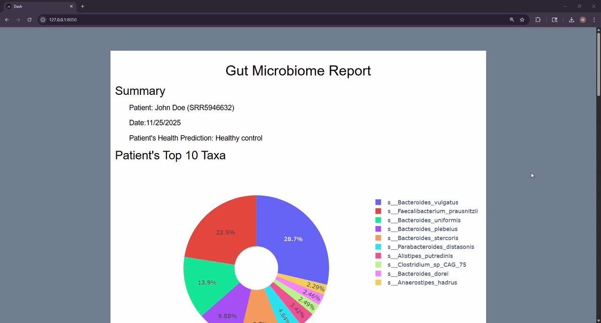
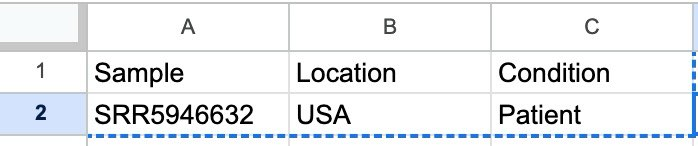

# BioTrack
> A pipeline for the analysis of patient gut microbiome data with easy-to-read report generation.

[](http://www.gnu.org/licenses/agpl-3.0)
[](http://www.gnu.org/licenses/agpl-3.0)

BioTrack is a multi-software program that combines nextflow microbiome alignment, to both R and python processing scripts. The goal of this software is to make these sepparate tools more accessable and generate the most streamlined experience for the user. Additionally, performing our analysis pipeline will allow you to compare a patient's gut microbiome data to over 2,000 samples and generate a predicted health outcome (healthy, ulcerative colitis, or crohn's disease).

Additionally, you can run our report software (step #4) to generate an interactive report of the patient's data that can be printed:



# Installation
**OS X & Linux:**

```sh
git clone https://github.com/nbratset/BioTrack.git
```

**Windows:**

```sh
git clone https://github.com/nbratset/BioTrack.git
```

**Alternative:**

Download a ZIP of the full repository:

> 

# Usage example
## Overview
1. Run Nextflow Pipeline to perform metagenomic sequencing sample alignment.
2. Build a Phyloseq object using R.
3. Run our analysis pipeline to predict patient health status.
4. Run our dash app which uses data from the analysis pipeline to generate an interactive report.

## Step 1: Nextflow Pipeline for Patient Sample Alignment
This first step is to take the gut microbiome patient samples and align them. This pipeline will generate a metaphlan output, which is used in later analysis.

1. See `Nextflow Alignment Pipeline Python Environment Setup` below to set up your python virtual environment to run this pipeline.

2. Once your micromamba environment it set up, download your patient data and set up your database.csv and samplesheet.csv files (found in [input_nextflow](https://github.com/nbratset/BioTrack/tree/main/input_nextflow)).

3. Run the nextflow pipeline either using sbatch or directly in command line:

    - **sbatch (for HPCs)**: Modify [`run_nextflow_pipeline.sh`](https://github.com/nbratset/BioTrack/blob/main/scripts/run_nextflow_pipeline.sh) to have your proper info in the header, micromamba environment, and file paths.

    - **Command Line**:
    ```sh
    # 1. Set up virtual python environment
    indir=YOUR_PATH/
    path_to_venv=YOUR_PATH/micromamba/envs/
    micromamba activate ${path_to_venv}nextflow_env

    # 2. Install host removal reference to $indir
    curl -O https://ftp.ncbi.nlm.nih.gov/genomes/all/GCF/000/819/615/GCF_000819615.1_ViralProj14015/GCF_000819615.1_ViralProj14015_genomic.fna.gz

    # 3. Create Metaphlan Database -- Run this if you do not have it already
    METAPHLAN_DB_DIR=YOUR_PATH/metaphlan_db_v3
    mkdir -p $METAPHLAN_DB_DIR
    metaphlan --install --db_dir $METAPHLAN_DB_DIR

    # 4. Run Nextflow Pipeline
    nextflow run nf-core/taxprofiler -r 1.1.0 \
    --input ${indir}samplesheet.csv \
    --databases ${indir}database.csv \
    --outdir ${indir}nextflow_results \
    --perform_shortread_qc \
    --perform_shortread_hostremoval \
    --hostremoval_reference ${indir}GCF_000819615.1_ViralProj14015_genomic.fna.gz \
    --perform_runmerging \
    --save_runmerged_reads \
    --run_metaphlan
    ```

4. If this runs properly, you should get a metaplan output that will be used in the next step.

## Step 2: Create a Phyloseq object from Metaplan Results
1. Download R and set up the packages in `R Setup for Phyloseq` below to run this R pipeline.

2. From your base directory, move your metaplan output files into a directory called `input_data`.

3. Set up your metadata file to include the patient as shown below:

    

4. Run the following command from your base directory:

    ```sh
    Rscript src/metaphlan_to_phyloseq.R \
    input_data/SRR5946632_pe_mpa_v31_CHOCOPhlAn_201901.metaphlan_profile.txt \
    input_data/metadata.csv \
    input_data/tax.csv \
    input_data/otu.csv \
    input_data/combined_metadata.csv
    ```

5. This creates 3 outputs: merged otu table (abundances of each taxa), merged taxonomy table (phylogeny of each taxa), and merged metadata (`combined_metadata.csv`).

## Step 3: Microbiome Analysis
1. See `Analysis Python Environment Setup` below to set up your python virtual environment to run this analysis.

2. Provide your output from the R script as input arguments to the analysis pipeline.

3. Run the following in your terminal:

    ```sh
    python src/run_pipeline.py \
        --location Netherlands \
        --otu_file input_data/otu.csv \
        --metadata_file input_data/combined_metadata.csv
    ```

    - _Note: Location is an optional argument, if you want to limit your analysis to a particular location. If not specificed, the analysis will run on the entire data set._

4. This will generate a handful of csv, png, and txt files in a folder called `results`.

## Step 4: Generate an Interactive Report
1. See `Report Generation Python Environment Setup` below to set up your python virtual environment to run this analysis.
    - Unfortunately, scikit-bio requires a downgraded version of numpy that is not compatible with plotly/dash. Therefore this script has to run on a sepparate virtual environment.

2. Provide your outputs from the analysis script above as input arguments to the analysis pipeline. If your directory structure is the same as this repo, the default arguments will work.

3. Run the following in your terminal:

    ```sh
    python src/app.py \
        -n "PATIENT NAME" \
        -t "input_data/otu.csv" \
        -a "results/alpha_diversity.csv" \
        -b "results/beta_diversity_coords.csv" \
        -d "results/differential_abundance_top_20.csv" \
        --date "10/16/2025"
    ```

    - _Note: t, a, b, d, and date are optional arguments. The file paths in the example above are the defaults if your files are in the same locations._
    - _Additionally, if you do not give a --date argument, it will default to the current date._

4. Once the report is generated, you can access it at the local URL <http://127.0.0.1:8050/> in your browser.

5. To save the report, right click on the browser output and click `Print...`. Then you can either directly print it to a Printer or Select `Save as PDF` to download to your computer.

# Environment Setups

The following sections describe how to install the 3 primary environment setups, 2 in python and 1 in R, required to run the full analysis. 

## Nextflow Alignment Pipeline Python Environment Setup
### 1. Install [micromamba](https://mamba.readthedocs.io/en/latest/installation/micromamba-installation.html)
This will depend heavily on your system. For our HPC, we used the following command:
```sh
curl micro.mamba.pm/install.sh | bash
```
More installation strategies can be found in the [micromamba documentation](https://mamba.readthedocs.io/en/latest/installation/micromamba-installation.html).

### 2. Create a nextflow virtual environment (for alignment pipeline)
```sh
micromamba create -n nextflow_env -c bioconda -c conda-forge nextflow
```

```sh
micromamba activate nextflow_env
```

### 3. Install dependancies
```sh
micromamba install -c conda-forge -c bioconda metaphlan=3.1.0
micromamba install -c conda-forge -c bioconda fastqc
micromamba install -c conda-forge -c bioconda fastp
micromamba install -c conda-forge -c bioconda bowtie2
micromamba install -c conda-forge -c bioconda multiqc
```
## R Setup for Phyloseq
You need to install R and R studio.

You need to make sure these packages are installed for the pipeline to run smoothly.

```R
install.packages("tidyverse")
install.packages("phyloseq")
install.packages("ggplot2")
install.packages("dplyr")
install.packages("openxlsx")
```


## Analysis Python Environment Setup
### 1. Install [micromamba](https://mamba.readthedocs.io/en/latest/installation/micromamba-installation.html)
This will depend heavily on your system. For our HPC, we used the following command:
```sh
curl micro.mamba.pm/install.sh | bash
```

### 2. Create a virtual environment (for report generation)
```sh
micromamba create -n biotrack_analysis_env python=3.11
```

```sh
micromamba activate biotrack_analysis_env
```

### 3. Install dependancies
#### Option 1: Using a  `analysis_requirements.txt`
```sh
pip install -r analysis_requirements.txt
```

#### Option 2: Manual Installation
```sh
  micromamba install scipy
  micromamba install scikit-learn
  micromamba install scikit-bio
  micromamba install pandas
  micromamba install matplotlib
  micromamba install statsmodels
  micromamba install numpy
  micromamba install seaborn
  micromamba install pingouin
  micromamba install ete3
  micromamba install r-essentials
  micromamba install r-base
  micromamba install rpy2
  micromamba install lefse
```

## Report Generation Python Environment Setup
### 1. Install [micromamba](https://mamba.readthedocs.io/en/latest/installation/micromamba-installation.html)
This will depend heavily on your system. For our HPC, we used the following command:
```sh
curl micro.mamba.pm/install.sh | bash
```

### 2. Create a virtual environment (for report generation)
```sh
micromamba create -n biotrack_report_env python=3.12
```

```sh
micromamba activate biotrack_report_env
```

### 3. Install dependancies
#### Option 1: Using  `report_requirements.txt`
```sh
pip install -r report_requirements.txt
```

#### Option 2: Manual Installation
```sh
micromamba install numpy
micromamba install pandas
micromamba install plotly
micromamba install dash
micromamba install dash_bootstrap_components
```
Note: I have had installation errors with `micromamba install dash_bootstrap_components`, and usually fixed those errors by running `pip install dash_bootstrap_components` instead.

# Release History
* 1.0.0
    * The first proper release
    * 12/02/2025
* 0.0.1
    * Work in progress

# Data Information and Model Processing
We downloaded 3 studies ([PRJNA945504](https://www.ncbi.nlm.nih.gov/bioproject/?term=PRJNA945504), [PRJNA398089](https://www.ncbi.nlm.nih.gov/bioproject/398089), [PRJNA400072](https://www.ncbi.nlm.nih.gov/bioproject/400072)) of microbiome data totalling to 2,034 samples with our script [`run_download_fastqs.sh`](https://github.com/nbratset/BioTrack/blob/main/scripts/run_download_fastqs.sh).

We used these samples with scikit.learn to train a model to differentiate patients who are healthy, have Ulcerative Colitis, or Crohn's disease. (file path to these processed data?)

# Creators
Arya Gautam – [Linkedin](https://www.linkedin.com/in/arya-gautam-a9a125204/) – [CU Profile](https://www.colorado.edu/certificate/iqbiology/natalie-marie-bratset)

Natalie Bratset – [Linkedin](https://www.linkedin.com/in/nbratset/) – [CU Profile](https://www.colorado.edu/certificate/iqbiology/arya-gautam)

Distributed under the AGPL-3.0 license. See ``LICENSE`` for more information.

This software was developed as part of CU Boulder's Software Engineering for Scientists (CSCI 6118) course.

# Acknowledgements
We would like to thank CU Boulder's IQ Biology Program, BioFrontiers, and the NSF for their support on this project.

We would also like to thank CU Boulder's [Biofrontiers IT Team (BIT)](https://bit.colorado.edu/) for allowing us to use their Fiji Computing Cluster, and for many emails and meetings of troubleshooting.

DISCLAIMER: This project, code, and reports generated do not provide medical advice. The information generated in the report is intended to be reviewed by a medical professional and cannot independently provide medical diagnoses. Always seek the advice of your physician or medical health provider for an official diagnosis and treatment information.
